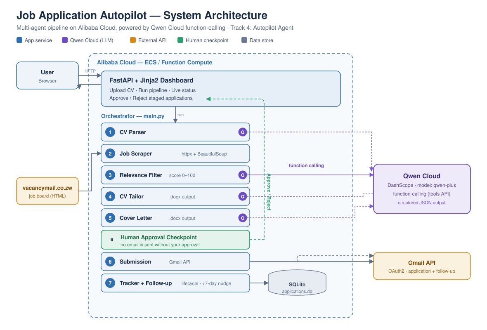
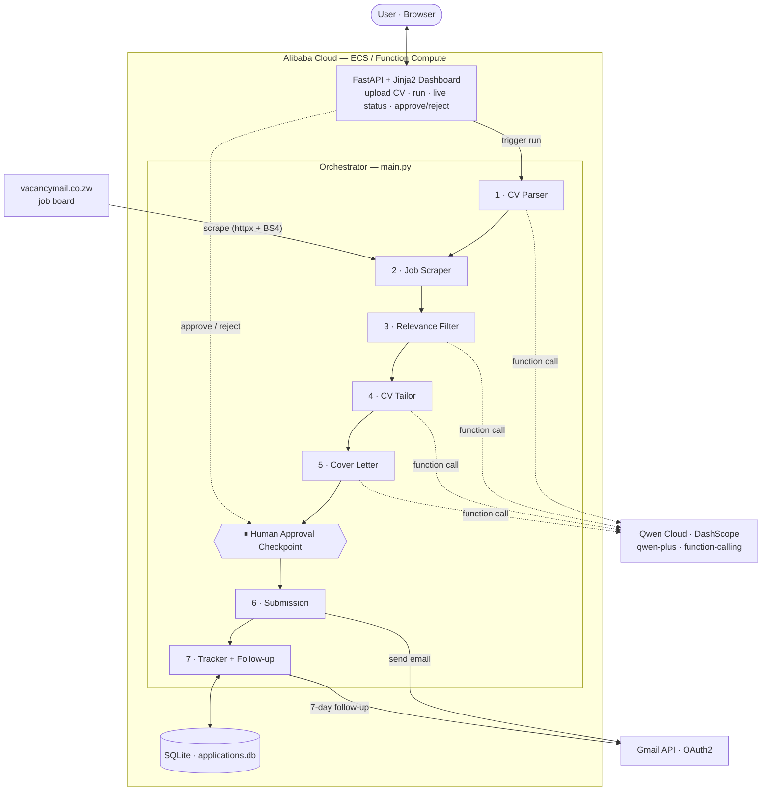

# Architecture — Job Application Autopilot

**Track 4: Autopilot Agent.** An autonomous multi-agent system that scrapes a job board,
scores each listing against the user's CV, generates tailored application documents, pauses
for **human approval**, then submits via email and tracks the full lifecycle. All LLM reasoning
runs on **Qwen Cloud** via the **function-calling (tools) API**; the backend is designed to run
on **Alibaba Cloud**.

## Diagram (Mermaid)

## Components

**FastAPI + Jinja2 dashboard** — the human interface. Users upload a CV, trigger a pipeline
run, watch live status, and — critically — **approve or reject** each staged application before
anything is emailed.

**Orchestrator (`main.py`)** — runs the seven-stage pipeline end to end and writes progress to a
status file the dashboard polls.

**Agents (`agents/`)**
- **CV Parser** — extracts a structured profile from a `.docx`/`.pdf` CV using Qwen function-calling (`record_cv_profile` tool schema).
- **Job Scraper** (`scrapers/vacancymail.py`) — pulls ICT listings and contact emails from vacancymail.co.zw with retry logic.
- **Relevance Filter** — scores each job 0–100 against the CV using Qwen function-calling (`record_job_match` tool schema); falls back to a heuristic keyword model when no API key is present.
- **CV Tailor** / **Cover Letter** — rewrite the CV summary and generate a per-job cover letter, both as `.docx`.
- **Submission** — sends the application email with attachments via the Gmail API.
- **Tracker** — SQLite single-source-of-truth for every application's state; **Follow-up** sends a polite nudge 7 days after sending.

**Human-in-the-loop checkpoint** — after documents are generated, applications enter the
`awaiting_approval` state and stop. The email is sent only when a human clicks **Approve & Send**
on the dashboard (or when the pipeline is explicitly run with `--send` for full autonomy).

## External services & data

| Dependency | Role | Integration |
|---|---|---|
| **Qwen Cloud (DashScope)** | All LLM reasoning: parsing, scoring, tailoring, writing | OpenAI-compatible endpoint, `qwen-plus`, **tools/function-calling** |
| **vacancymail.co.zw** | Source of job listings | `httpx` + BeautifulSoup |
| **Gmail API** | Sending applications and follow-ups | OAuth2 (`credentials.json` / `token.json`) |
| **SQLite** | Application lifecycle state | local file `applications.db` |

## Application lifecycle (status states)

`pending → tailoring → awaiting_approval → sent → followed_up → interview / rejected / closed`

The `awaiting_approval` state is the human decision point that satisfies Track 4's requirement
for *"human-in-the-loop checkpoints at critical decision points."*
